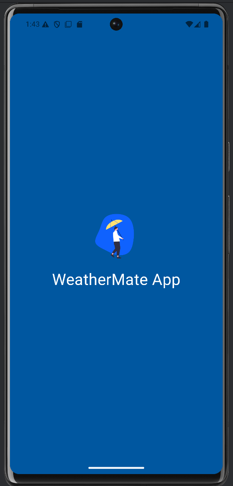
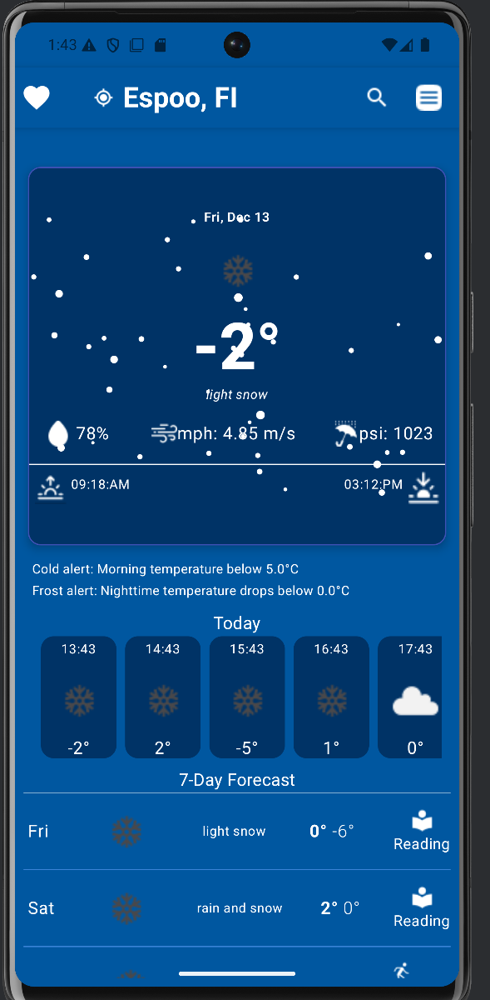
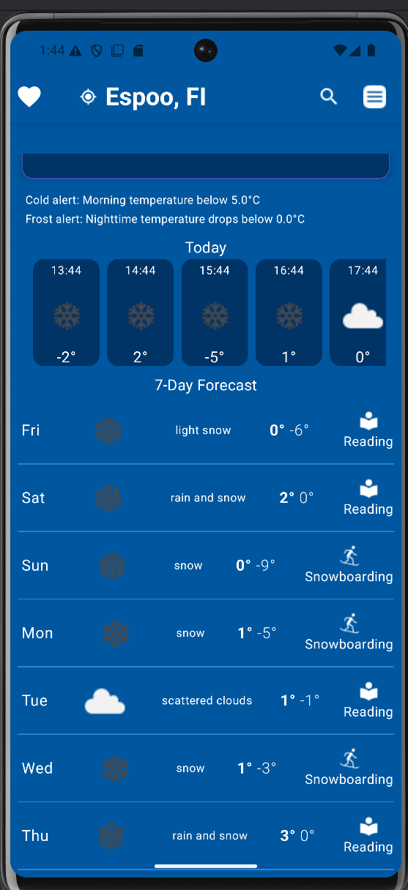
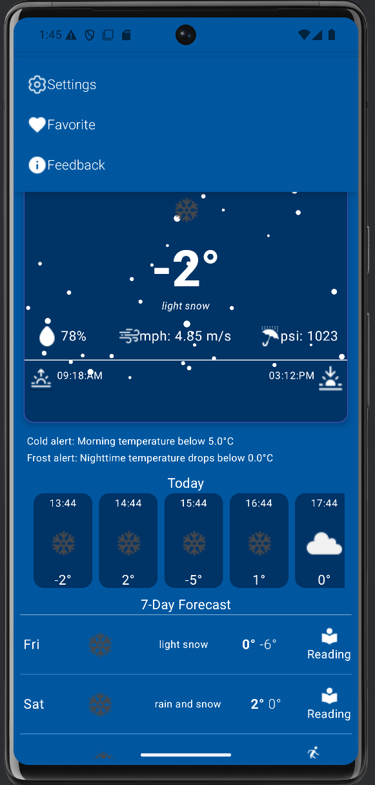
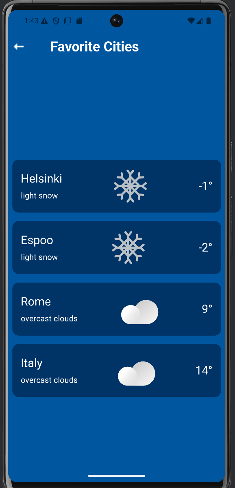
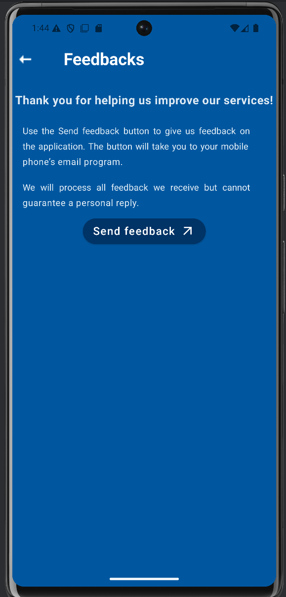
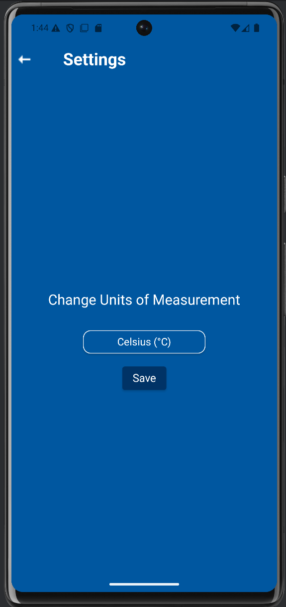
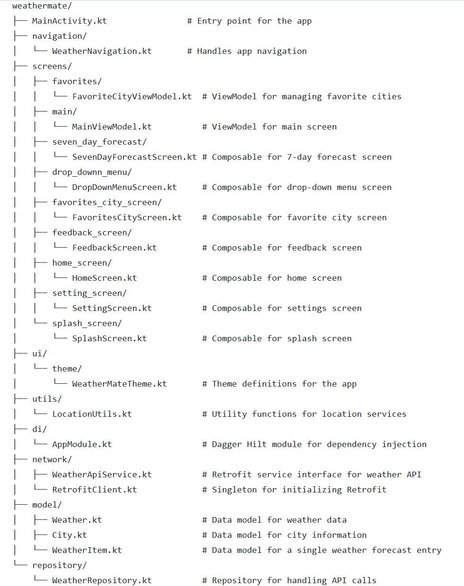

# WeatherMate App  

  
  
  
  
  

<a name="top"></a>

## Table of Contents
- [Overview](#overview)
- [Features](#features)
- [Screenshots](#screenshots)
- [How to Build From Source](#how-to-build-from-source)
  - [Prerequisites](#prerequisites)
  - [Setup Instructions](#setup-instructions)
- [Project Structure](#project-structure)
  - [Core Components](#core-components)
  - [Network](#network)
  - [Model](#model)
- [Tech Stack Used](#tech-stack-used)
  - [Dependencies](#dependencies)
  - [Plugins](#plugins)
- [How It Works](#how-it-works)
- [Future Improvements](#future-improvements)
- [License](#license)


## Overview  
WeatherMate is a Kotlin-based Android application that provides real-time weather data and 7-day forecasts using the OpenWeatherMap API. Designed with Jetpack Compose, the app adheres to modern Android development practices, including dependency injection with Dagger Hilt, to ensure scalability and maintainability.


## Features  
- **Real-Time Weather**: Fetches current weather data for the user's location.  
- **7-Day and Hourly Forecasts**: Displays detailed weather information for the next 7 days and hourly updates.  
- **Refresh Location**: Allows users to update weather data by refreshing their location.  
- **Saved Locations**: Enables users to save and manage their favorite cities.  
- **Unit Preferences**: Switch between Celsius and Fahrenheit.  
- **Weather Alerts**: Sends notifications for significant weather changes.  
- **Activity Recommendations**: Provides personalized suggestions based on weather conditions.  
- **User-Friendly UI**: Designed using Jetpack Compose with Material 3 styling.  
- **Accessibility**: High-contrast design and clear labels for inclusivity.  


## Screenshots  

| Splash Screen           | Home Screen            | 7-Day Forecast         | Drop Down Menu         |
|--------------------------|------------------------|-------------------------|------------------------|
|  |  |  |  |

| Favorites City Screen   | Feedback Screen        | Setting Screen         |
|--------------------------|------------------------|-------------------------|
|  |  |  |


[↑ Back to top](#top)




### Core Components
- **`MainActivity.kt`**: Entry point for the app. Handles navigation using Jetpack Navigation.
- **`WeatherScreen.kt`**: Displays current weather data and navigation options.
- **`SevenDayForecast.kt`**: Lists the 7-day weather forecast using a lazy column.
- **`WeatherViewModel.kt`**: ViewModel for managing weather data and state.
- **`WeatherRepository.kt`**: Repository for handling API calls.
- **`AppModule.kt`**: Dagger Hilt module for dependency injection.
- **`LocationUtils.kt`**: Handles location fetching using FusedLocationProviderClient.

### Network
- **`WeatherApiService.kt`**: Retrofit service interface for the OpenWeatherMap API.
- **`WeatherApi.kt`**: Singleton for initializing the Retrofit instance.

### Model
- **`Weather.kt`**: Data model representing weather data.
- **`City.kt`**: Represents city data.
- **`WeatherItem.kt`**: Represents a single weather forecast entry.


## Tech Stack Used


[↑ Back to top](#top)


### Dependencies
- **Kotlin**: Primary programming language used for building the app.
- **Jetpack Compose**: Framework for declarative UI creation and building responsive layouts.
- **Compose Navigation**: Library for navigating between screens within the Compose framework.
- **Coil**: Image loading library optimized for Android.
- **Coroutines**: Enables asynchronous programming for tasks like API calls, database access, and background processing.
- **Hilt (Dependency Injection)**: Framework for managing dependencies and achieving modularization.
- **Retrofit**: HTTP client library used for making API calls to fetch weather and alert data.
- **OkHTTP**: Networking library required by Retrofit for HTTP requests.
- **Room DB**: Local database solution to store weather data, user preferences, and cached results.
- **Kotlinx Serialization**: Serialization library used for converting Kotlin objects to/from JSON.
- **AndroidX**: A collection of modern libraries for Android development (ViewModel, LiveData, etc.).
- **ViewModel**: Architecture component for managing UI-related data in a lifecycle-aware manner.
- **android-maps-compose**: Compose library for integrating Google Maps to display user locations and weather.
- **Gson**: JSON parsing library used for handling API responses (alternative to kotlinx.serialization).
- **OpenWeatherMap**: API used to fetch real-time weather and forecast data.
- **Accompanist System UI Controller**: Manages status bar and navigation bar appearance.
- **Lottie Animation**: Adds vector animations to the app.
- **Google Play Services Location**: Provides precise user location to deliver localized weather data.
- **Accompanist Permissions**: Simplifies permissions handling in Jetpack Compose.

### Plugins
- **Android Application Plugin**: Core plugin for building Android applications.
- **Kotlin Android Plugin**: Enables using Kotlin as the programming language for Android apps.
- **Kotlin Kapt**: Kotlin Annotation Processing Tool for code generation (used by Hilt and Room).
- **Hilt Android Plugin**: Simplifies dependency injection setup in Android projects.


## How It Works


[↑ Back to top](#top)


### Features
- **Current Location Weather**: Automatically fetches and displays weather data based on the user's real-time GPS location.
- **Search City Weather**: Users can search for weather data of any city globally.
- **Save Cities**: Users can save their favorite cities for quick access to weather information.
- **Unit Changes**: The app allows switching between Celsius and Fahrenheit, and updates all displayed temperatures accordingly.
- **Activity Recommendations**: Provides personalized activity suggestions based on the weather conditions.
- **Weather Alerts**: Notifies users about significant weather changes, like storms or extreme temperatures.
- **Feedback**: Users can submit feedback directly through the app for continuous improvement.


## Future Improvements

- Expand the activity recommendation engine with AI-driven insights.
- Incorporate more detailed weather parameters, such as air quality and UV index.
- Launch on multiple platforms, including iOS.
- Add support for multiple languages.
# Contributing

We welcome contributions! Follow the steps below to set up your development environment and contribute to the project.

## Prerequisites

1. - **Install Android Studio**:  
   Download Android Studio from [here](https://developer.android.com/studio) and follow the installation instructions for your platform.
   - **OpenWeatherMap API Key**: Sign up for a free API key at [OpenWeatherMap](https://openweathermap.org/).  


3. - **Important**:  
   The app targets **Android API level 35**. Ensure your device or emulator meets the required version to avoid issues.

## Getting the Code

You can get the project in one of two ways:

- **Clone the repository**:
  ```bash
  git clone git@https://github.com/kiranpok/WeatherMate.git


## Download the ZIP

Alternatively, you can download the project directly from the [GitHub repository](https://github.com/kiranpok/WeatherMate.git). and extract it to your local machine.


[↑ Back to top](#top)


### Steps to Run the App
1. Open the project in **Android Studio**.
2. Add your API key to the `utils/Constants.kt` file:
    ```properties
   const val API_KEY = "Add your api key here"
    ```
4. Build the project by selecting **Build > Make Project** in Android Studio.
5. Run the app on an emulator or connected device.


  
  
[↑ Back to top](#top)

## Known Bugs

- The current location fetch works only with a physical device, not with the Android Studio emulator.

## License

This project is licensed under the ##MIT License.## By contributing, you agree that your contributions will be licensed under the MIT License. See the LICENSE file for details.
